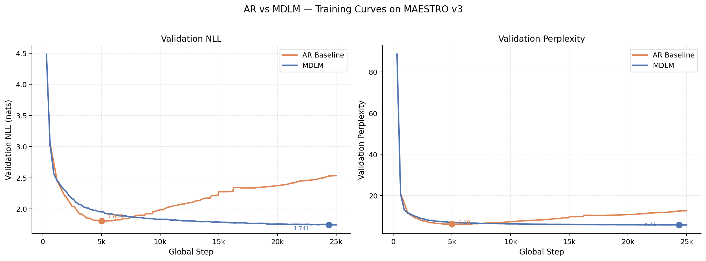
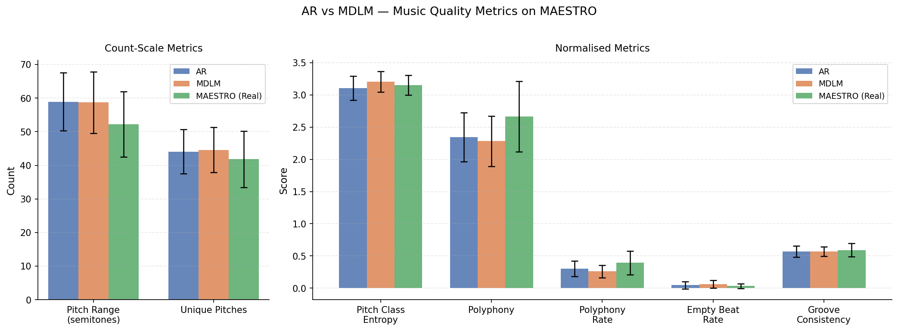

# MDLM for Symbolic Music Generation

> **Forked from [s-sahoo/duo](https://github.com/s-sahoo/duo).**
> This fork applies Masked Diffusion Language Models (MDLM) and an Autoregressive (AR) Transformer baseline to symbolic music generation on MAESTRO v3, as part of EAI 6020: AI System Technologies at Northeastern University (Spring 2026).

---

## Overview

This project is the first application of MDLM (Sahoo et al., NeurIPS 2024) to symbolic music generation using MIDI tokens. MDLM's bidirectional masked diffusion is compared against an AR Transformer baseline under identical model capacity and training conditions.

**Key results:**

| Model | Params | Best Val NLL | Best Val PPL |
|-------|--------|-------------|-------------|
| AR Baseline | 38.1M | 1.805 | 6.08 |
| MDLM | 43.1M | **1.741** | **5.70** |

MDLM also uniquely enables **musical infilling** (reconstructing masked middle sections of real pieces), achieving PCHO 0.855 and groove similarity 0.640 over 50 MAESTRO validation pieces.

---

## Project Details

### Research Question

Autoregressive (AR) Transformers dominate symbolic music generation but are fundamentally limited to left-to-right generation — they cannot condition on future context or fill in missing sections of a piece. Masked Diffusion Language Models (MDLM, NeurIPS 2024) train across all masking rates simultaneously, enabling both unconditional generation and native infilling. This project asks: does MDLM's success on text transfer to symbolic music, and does bidirectional context help despite music's strongly sequential temporal structure?

### Dataset

MAESTRO v3 contains 1,276 professional piano performances (~200 hours) from the International Piano-e-Competition. All MIDI files are tokenized using MidiTok v3 with the REMI scheme, which encodes music as sequences of BAR, POSITION, PITCH, VELOCITY, and DURATION tokens. Sequences are chunked to 1,024 tokens with 512-token overlap, preserving piece boundaries so no chunk spans two different pieces. This produces 41,528 training chunks, 4,694 validation chunks, and 5,412 test chunks over a vocabulary of 348 tokens.

### Models

Both models share an identical DIT (Diffusion Transformer) backbone with 12 layers, 512 hidden dimensions, 8 attention heads, rotary positional embeddings, and pre-norm. The only architectural differences are:

- **AR Baseline (38.1M params):** causal (left-to-right) attention, trained with next-token prediction cross-entropy.
- **MDLM (43.1M params):** bidirectional attention, trained by masking tokens at all rates from 0–100% and learning to reconstruct them. The extra 5M parameters over AR are entirely in time-conditioning layers.

### Training

Both models are trained for 25,000 optimizer steps with effective batch size 64, fp16 mixed precision, and Adam optimizer. AR training used Kaggle 2×T4 GPUs (~40-50 hrs). MDLM training used a single Azure T4 GPU (~60-70 hrs). Training was monitored via WandB; the CSV exports are in `outputs/`.

### Evaluation

Three evaluation axes are used:

1. **Density estimation** — Validation NLL and perplexity tracked throughout training. Lower is better.
2. **Generation quality** — MusPy metrics (pitch class entropy, pitch range, unique pitches, polyphony, polyphony rate, empty beat rate, groove consistency) computed over 50 generated samples per model and compared against 50 real MAESTRO validation pieces.
3. **Infilling (MDLM only)** — The middle 50% of 50 MAESTRO validation pieces is masked (256 context tokens, 512 masked, 256 suffix) and reconstructed via 500 ancestral denoising steps. Quality is measured using Pitch Class Histogram Overlap (PCHO), groove similarity, and Note Density Ratio — standard metrics from recent symbolic music infilling literature (MIDI-RWKV, Pasquier et al., 2025).

### Key Findings

- MDLM achieves val NLL 1.741 vs AR's 1.805, a 3.5% improvement, but requires approximately 4× more training steps to converge.
- Both models produce statistically comparable MusPy metrics at n=50, confirming they learned the same underlying musical distribution.
- MDLM infilling achieves PCHO 0.855 (high tonal coherence) and groove similarity 0.640 (moderate rhythmic consistency). AR cannot perform infilling at all.
- The key differentiator between the models is infilling capability, not unconditional generation quality.

For full methodology, analysis, and discussion see the DEVLOG.md (implementation diary) and the accompanying course report.

---

## Repository Structure

```
duo/
├── configs/                  # Hydra configs (data, model, algo, etc.)
│   ├── config.yaml
│   ├── data/maestro.yaml
│   ├── model/midi-small.yaml
│   └── ...
├── models/                   # DIT backbone, EMA, UNet
├── scripts/                  # Project-specific scripts
│   ├── preprocess_maestro.py
│   ├── generate_samples.py
│   ├── infilling.py
│   ├── evaluate_metrics.py
│   ├── evaluate_infilling.py
│   ├── midi_to_audio.py
│   └── plot_training_curves.py
├── outputs/
│   ├── figures/
│   ├── metrics_comparison.png
│   ├── metrics_results.json
│   ├── infilling_metrics.json
│   ├── wandb_val_nll.csv
│   └── wandb_val_ppl.csv
├── algo.py
├── dataloader.py
├── main.py
├── trainer_base.py
├── metrics.py
├── utils.py
├── DEVLOG.md
├── requirements.txt
├── requirements-midi.txt
└── LICENSE
```

---

## Setup

```bash
# 1. Clone
git clone https://github.com/rahul-s-rajput/mdlm-symbolic-music.git
cd mdlm-symbolic-music

# 2. Install core dependencies
pip install -r requirements.txt

# 3. Install MIDI dependencies
pip install -r requirements-midi.txt

# 4. Download MAESTRO v3
#    https://magenta.tensorflow.org/datasets/maestro
#    Extract to data/maestro-v3.0.0/

# 5. Tokenize and chunk
python scripts/preprocess_maestro.py \
    --maestro_dir data/maestro-v3.0.0 \
    --output_dir data/maestro_tokenized

# 6. (Optional) Download soundfont for audio rendering
#    Get GeneralUser GS from https://schristiancollins.com/generaluser.php
#    Place as GeneralUser-GS.sf2 in the project root
```

---

## Training

```bash
# AR Baseline
python main.py \
    data=maestro \
    model=midi-small \
    algo=ar \
    trainer.max_steps=25000 \
    attn_backend=sdpa

# MDLM
python main.py \
    data=maestro \
    model=midi-small \
    algo=mdlm \
    trainer.max_steps=25000 \
    sampling.predictor=ancestral_cache \
    attn_backend=sdpa
```

**Hardware and training time:**
- AR: Kaggle 2×T4 (~40-50 hrs)
- MDLM: Azure 1×T4 (~60-70 hrs)

---

## Checkpoints

Trained checkpoints are hosted on Hugging Face Hub: [rahul016/mdlm-symbolic-music](https://huggingface.co/rahul016/mdlm-symbolic-music)

```python
from huggingface_hub import hf_hub_download

# AR baseline (38.1M params, val NLL 1.805)
hf_hub_download(
    repo_id="rahul016/mdlm-symbolic-music",
    filename="ar_best.ckpt",
    local_dir="."
)

# MDLM (43.1M params, val NLL 1.741)
hf_hub_download(
    repo_id="rahul016/mdlm-symbolic-music",
    filename="mdlm_best_nll1.741.ckpt",
    local_dir="."
)
```

Or via CLI:
```bash
huggingface-cli download rahul016/mdlm-symbolic-music ar_best.ckpt --local-dir .
huggingface-cli download rahul016/mdlm-symbolic-music mdlm_best_nll1.741.ckpt --local-dir .
```

---

## Evaluation

```bash
# Generate samples (adjust --checkpoint path)
python scripts/generate_samples.py \
    --model ar   --checkpoint ar_best.ckpt   --num_samples 50
python scripts/generate_samples.py \
    --model mdlm --checkpoint mdlm_best.ckpt --num_samples 50

# MusPy music quality metrics
python scripts/evaluate_metrics.py

# MDLM infilling
python scripts/infilling.py \
    --checkpoint mdlm_best.ckpt --num_pieces 50

# Infilling quality metrics (PCHO / groove / NDR)
python scripts/evaluate_infilling.py

# Convert MIDI to audio
python scripts/midi_to_audio.py --soundfont GeneralUser-GS.sf2

# Plot training curves (from WandB CSV exports)
python scripts/plot_training_curves.py
```

---

## Audio Samples

All generated MIDI files are committed to [`outputs/samples/`](outputs/samples/):

```
outputs/samples/
├── ar/           # 50 unconditional AR generations
├── mdlm/         # 50 unconditional MDLM generations
└── infilling/    # 50 pieces × 3 files = 150 MIDIs
                  # (piece_N_original.mid / piece_N_masked.mid / piece_N_infilled.mid)
```

Total: 250 MIDI files, ~431KB. Play in any MIDI player (VLC, GarageBand, MuseScore). To convert to audio:
```bash
python scripts/midi_to_audio.py --input outputs/samples/ --soundfont GeneralUser-GS.sf2
```

Full WAV renders are available on Hugging Face Hub at [rahul016/mdlm-symbolic-music](https://huggingface.co/rahul016/mdlm-symbolic-music) under `audio/`.

---

## Results

### Training Curves



### Music Quality Metrics (n=50 per model)



### Infilling Quality (n=50 MAESTRO validation pieces)

| Metric | Mean | Std |
|--------|------|-----|
| Pitch Class Histogram Overlap (PCHO) | 0.855 | ±0.107 |
| Groove Similarity | 0.640 | ±0.155 |
| Note Density Ratio | 0.968 | ±0.381 |

---

## Citation

If you use this code, please cite the original DUO paper:

```bibtex
@inproceedings{sahoo2025duo,
  title={The Diffusion Duality},
  author={Sahoo, Subham and others},
  booktitle={ICML},
  year={2025}
}
```

And the MDLM paper:

```bibtex
@inproceedings{sahoo2024mdlm,
  title={Simple and Effective Masked Diffusion Language Models},
  author={Sahoo, Subham and others},
  booktitle={NeurIPS},
  year={2024}
}
```

---

## License

Apache 2.0 — see [LICENSE](LICENSE). This fork inherits the upstream license.
